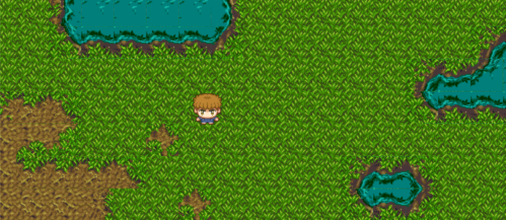

Island (Discrete)
=================

Almost the same as :ref:`islandexample`, this version uses :py:class:`DiscretePhysicsEngine`
instead. The player moves from tile to tile, starting and ending each move in a specific
location. 

.. automodule:: quest.examples.island_discrete
   :members:

